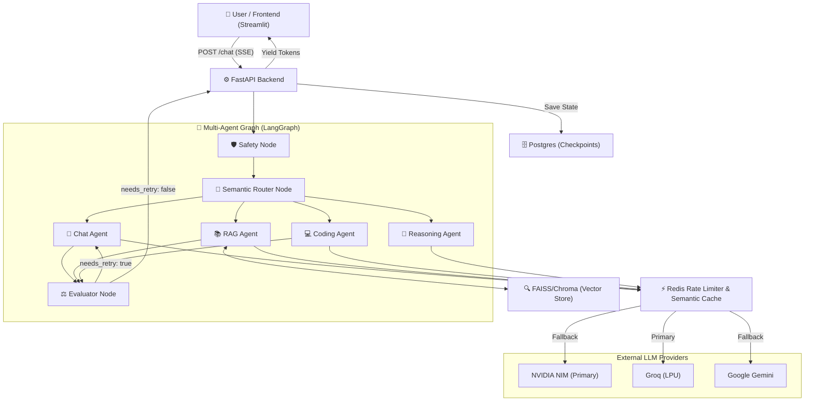

# Cognibot: Enterprise Multi-Agent AI Architecture 🤖

[](https://www.python.org/)
[](https://fastapi.tiangolo.com/)
[](https://python.langchain.com/v0.1/docs/langgraph/)
[](https://www.docker.com/)

Cognibot is a production-grade, stateful, multi-agent Retrieval-Augmented Generation (RAG) system. Designed to mirror FAANG-level LLMOps architectures, it utilizes **LangGraph** for deterministic workflow orchestration, features strict fallbacks across leading model providers (NVIDIA NIM, Groq, Google GenAI), and employs semantic caching to drastically reduce latency and token spend.

---

## 📐 System Design & Architecture

This repository is built for production readiness. Comprehensive system design documentation is available to detail the architectural decisions, data flows, and infrastructure limits.



*   **[High-Level Design (HLD)](hld.md)**: Explore the macro-architecture, infrastructure components, scalability constraints, and the global failover strategy.
*   **[Low-Level Design (LLD)](lld.md)**: Deep dive into the LangGraph state machine, core schemas, evaluator node heuristics, and API streaming configurations.
*   **[Strategy Notes](notes.md)**: Insight into the engineering trade-offs, rate-limiting rationale, and LLM behavior management.

## 🚀 Key Engineering Features

*   **Multi-Agent Orchestration (LangGraph):** A deterministic state machine routing tasks between specialized agents (Coding, Vision, RAG, Evaluator) rather than relying on unstructured ReAct prompting.
*   **Semantic LLM Caching (Redis Stack):** Automatically maps user queries to vector embeddings (`nv-embedqa-e5-v5`). If a mathematically similar query (>95% match) exists in the Redis vector database, it intercepts the API call and returns the cached response in ~50ms.
*   **Cross-Provider Fallback Routing:** If the primary NVIDIA NIM node hits rate limits or throws a 503, the router instantly falls back to Groq (Llama-3), then Google Flash, ensuring zero downtime.
*   **Distributed Rate Limiting:** Implements a sliding-window algorithm via Redis to prevent cascading failures during traffic spikes.
*   **Real-time Token Streaming:** Utilizes FastAPI `StreamingResponse` (SSE) to yield tokens to the frontend instantly, eliminating input buffering.
*   **Persistent Memory Checkpointing:** Postgres-backed state checkpoints allow agents to seamlessly resume conversation threads even if the container crashes.

## 🛠 Tech Stack

*   **Backend:** FastAPI, Python 3.11
*   **Frontend:** Streamlit
*   **AI/Orchestration:** LangChain, LangGraph
*   **Models:** Qwen 2.5 32B (Coding), Llama 3.2 11B Vision (OCR), Llama 3.1 (RAG) via NVIDIA NIM & Groq.
*   **Infrastructure:** Docker Compose, Redis Stack (Cache/Rate Limiter), PostgreSQL (State Persistence), ChromaDB (Document Retrieval).

## ⚡ Quick Start

### 1. Prerequisites
Ensure you have [Docker](https://www.docker.com/) and [Docker Compose](https://docs.docker.com/compose/) installed on your machine.

### 2. Environment Setup
Create a `.env` file in the root directory and add your API keys:
```env
NVIDIA_API_KEY=your_key
GROQ_API_KEY=your_key
GOOGLE_API_KEY=your_key
```

### 3. Build & Run
Spin up the entire architecture (FastAPI Backend, Streamlit Frontend, Postgres, and Redis Stack) with a single command:
```bash
docker-compose up -d --build
```

### 4. Access the Application
*   **UI:** `http://localhost:8501`
*   **Backend API Docs:** `http://localhost:8000/docs`

---
*Built to demonstrate senior-level ML Engineering, robust LLMOps, and scalable Agentic AI system design.*
