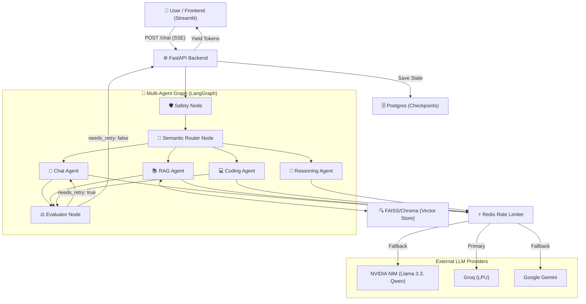

# High Level System Design (HLD)
### Cognibot: LangGraph Multi-Agent Architecture

---

### Section 1 — System Classification
- **Inference Mode:** Real-time (Synchronous Streaming SSE)
- **State Management:** Persistent (Postgres-backed LangGraph Checkpoints)
- **Use-case Category:** Multi-Agent LLM Orchestration, RAG, Code Generation, LLM-as-a-Judge Auditing

---

### Section 2 — Architecture Diagram

---

### Section 3 — Component Design

**1. FastAPI Server-Sent Events (SSE) Layer**
- **Responsibility:** Maintain open connections to yield LLM tokens and agent state transitions in real-time.
- **Tech Choice:** `StreamingResponse` with generator functions. Avoids WebSockets overhead while allowing unidirectional live updates.

**2. LangGraph State Machine**
- **Responsibility:** Orchestrate cyclical multi-agent workflows, allowing loops (retry mechanisms) and memory persistence.
- **Tech Choice:** `StateGraph` over LCEL (LangChain Expression Language) because LCEL is strictly DAG (Directed Acyclic Graph) and cannot handle recursive evaluation loops.

**3. Redis Rate Limiter**
- **Responsibility:** Track model RPMs dynamically and failover to fallback providers to prevent API crashes.
- **Tech Choice:** Redis sliding-window algorithm. A token bucket is insufficient because we need exact time-to-decay metrics across multiple distributed containers.

**4. Semantic Router**
- **Responsibility:** Classify intent to map the task to the most appropriate, cost-effective LLM.
- **Tech Choice:** Few-shot prompting on a fast Groq model.

**5. Evaluator (LLM-as-a-Judge)**
- **Responsibility:** Audit responses against ground-truth context and user prompts to prevent hallucinations.
- **Input/Output:** In: `{question, context, answer}`. Out: Strict JSON `{"needs_retry": bool}`.

---

### Section 4 — Scalability Plan

| Scale | Architecture Change |
|-------|-------------------|
| **1K users** | Current monolithic FastAPI + local Redis/Postgres works perfectly. |
| **10K users** | SSE connections will exhaust local FastAPI workers. Must introduce horizontal scaling behind an Nginx reverse proxy or AWS ALB. |
| **100K users** | Move State persistence from Postgres to DynamoDB or Cassandra. Decouple streaming from the inference loop via Redis PubSub or Kafka. |
| **1M users** | Switch from proprietary external APIs (NVIDIA/Groq) to self-hosted vLLM/TGI clusters on dedicated GPU nodes (A100/H100) to control spiraling inference costs. |

---

### Section 5 — Reliability & Fault Tolerance

| Scenario | Detection | Recovery Action | User Impact |
| :--- | :--- | :--- | :--- |
| **Primary LLM Rate Limit Hit** | Redis intercept raises `RateLimitError` before API call. | `utils/rate_limiter.py` reroutes traffic instantly via `FALLBACK_CHAIN`. | Transparent. Minor latency increase if fallback is slower. |
| **Provider Outage (e.g., NVIDIA down)** | LangChain Wrapper throws generic API/Timeout Exception. | Try/except block in `fallback.py` catches instantiation failure and cascades down the chain. | Transparent. |
| **Evaluator Outputs Broken JSON** | `json.loads()` throws `JSONDecodeError`. | Regex pre-processor strips markdown backticks and control characters. Returns safe default if all retries fail. | None. Audit bypassed safely. |
| **Reasoning Model Yields Empty String** | `rag_agent` checks for `not response.content`. | `ValueError` thrown inside the node, caught by graph execution engine. | Error banner presented to user. |

---

### Section 6 — Cost Optimization Analysis

| Component | Current Cost Driver | Optimization Strategy |
|-----------|--------------------|-----------------------|
| **Compute (LLMs)** | 90B Vision Models and 70B Instruct models. | **Implemented:** Router maps simple coding to 32B, generic chat to Groq Free Tier, and drops Vision from 90B to 11B as primary. |
| **Compute (Embeddings)** | Repeatedly embedding duplicate RAG queries. | **Planned:** Implement Semantic Caching (e.g., GPTCache) to intercept similar queries before hitting embedding APIs. |
| **Storage** | Postgres bloating with LangGraph checkpoint history. | **Planned:** Implement a TTL (Time-To-Live) chron job to purge checkpoints older than 30 days. |
