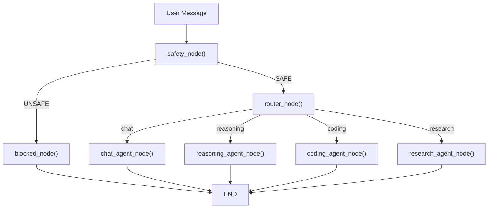

# Low Level Design (Engineering Depth)

### Section 1 — Codebase Architecture Map

```
repo/
├── backend/
│   └── main.py              → API Gateway → Exposes FastAPI REST & SSE endpoints
├── frontend/
│   └── app.py               → UI Client   → Streamlit interface consuming FastAPI
├── core/
│   ├── orchestrator.py      → State Machine → Compiles LangGraph StateGraph & nodes
│   └── router.py            → Logic       → Intent classification (keyword-based)
├── agents/
│   ├── safety_agent.py      → Guardrails  → Fast blocklist & LLM safety check
│   ├── chat_agent.py        → General AI  → Uses Llama-3.3-70B
│   ├── reasoning_agent.py   → CoT AI      → Uses DeepSeek-R1
│   ├── coding_agent.py      → Code AI     → Uses Qwen2.5-Coder
│   └── research_agent.py    → Search AI   → Uses Tavily + Llama-3.3-70B
├── models/
│   ├── nvidia.py            → Provider    → Instantiates LangChain Chat models
│   └── fallback.py          → Resilience  → Tenacity retries + RateLimiter routing
└── utils/
    ├── logger.py            → Observability→ `structlog` configuration
    └── rate_limiter.py      → Throttling  → Thread-safe sliding window
```

**Evaluation:**
- **Separation of concerns:** High. Excellent decouple of UI, API, Orchestration, and Models.
- **Testability:** High. Individual agent nodes can be unit tested without spinning up the graph.
- **Configurability:** Medium. Rate limits and models are somewhat hardcoded in `utils/rate_limiter.py` and `models/nvidia.py` instead of injected via config files.

### Section 2 — Pipeline Flow (LangGraph Internal)



### Section 3 — Function-Level Breakdown

```text
Function: check_safety
File: agents/safety_agent.py
Input: str (user_input)
Output: tuple[bool, str]
What it does: Runs a fast Regex keyword check, then falls back to an LLM semantic check for safety policy violations.
Hidden bugs: The `except Exception` returns `True, "check skipped"`. This fail-open design could expose the application to malicious prompts during API downtime.
How to improve: Depending on risk tolerance, change to fail-closed, or add an explicit timeout to the safety LLM call.

Function: route
File: core/router.py
Input: str (user_input), Optional[str] (file_path)
Output: RoutingDecision
What it does: Uses keyword string matching to determine the intent of the prompt and assign an agent/model.
Hidden bugs: Order of `if` statements matters. `CODE_KEYWORDS` checked before `REASONING_KEYWORDS` means overlapping intents might misroute.
How to improve: Replace keyword matching with semantic embedding classification.

Function: get_model_with_fallback
File: models/fallback.py
Input: str (primary_model), float (temperature)
Output: BaseChatModel
What it does: Consults the `rate_limiter` to get an available model from the fallback chain, records the request, and returns the instantiated LangChain model.
Hidden bugs: If the rate limiter is out of sync with actual API limits, the returned model might still immediately throw a 429.
How to improve: Ensure `Tenacity` catches the 429 and recurses back into this function to pick the *next* fallback.
```

### Section 4 — API Layer Design (FastAPI)

```text
Endpoint: POST /chat/stream
Request: 
{ 
  "message": "Write a python script...", 
  "thread_id": "uuid-1234" 
}
Response: HTTP/1.1 200 OK (Content-Type: text/event-stream)
data: {"content": "Here is..."}
data: {"content": " the code..."}
data: [DONE]
Missing: JWT Authentication, Rate Limiting Middleware (at the API gateway level, not just the LLM level), Input Validation limits (max string length).
```

### Section 5 — Edge Case Catalog

| Input Scenario | Current Behavior | Expected Behavior | Fix Required |
|---------------|-----------------|-------------------|-------------|
| 100,000 char input | Passed to Safety/LLM | Rejected by API | Add `MaxLength` validation in Pydantic schema. |
| SQLite lock | Exception thrown, SSE connection drops | Retry with exponential backoff | Add `Tenacity` retries around the `orchestrator.stream()` call. |
| Tavily API down | Exception caught, `pass` | Continue without context | None (designed to be resilient). |

### Section 6 — Refactoring Blueprint

**Before (core/router.py):**
```python
if any(k in text for k in CODE_KEYWORDS):
    return RoutingDecision("coding", ...)
if any(k in text for k in REASONING_KEYWORDS):
    return RoutingDecision("reasoning", ...)
```

**After:**
```python
# refactored version
# Pre-compute embeddings for intents, use cosine similarity
def route(user_input: str) -> RoutingDecision:
    input_emb = get_fast_embedding(user_input)
    best_intent = max(INTENT_EMBEDDINGS.keys(), key=lambda k: cosine_sim(input_emb, INTENT_EMBEDDINGS[k]))
    return RoutingDecision(best_intent, ...)
```
**Why:** Brittle keyword matching fails in production. Semantic routing handles nuance and synonyms gracefully.

### Section 7 — Productionization Checklist

```
[x] requirements.txt with pinned versions
[x] Dockerfile with multi-stage build
[x] Environment variable management (.env / secrets manager)
[x] Logging (structured JSON logs via structlog)
[ ] Error handling (no bare except) - Partial
[x] Input validation (pydantic / marshmallow) - Basic in FastAPI
[ ] Model versioning strategy
[ ] Artifact storage (S3 / GCS / local)
[x] Health check endpoint (`/health`)
[ ] Graceful shutdown
[x] CI/CD pipeline - Partial (Docker-compose)
[ ] Model registry
[ ] A/B testing capability
[ ] Rollback mechanism
[x] Documentation
```

# 🔥 MANDATORY FINAL SECTION

## ❌ Complete Gap List
1. **Concurrency State Management:** SQLite `check_same_thread=False` with LangGraph checkpointer will lock or corrupt under high concurrent traffic. Must migrate to PostgreSQL.
2. **Observability:** Missing LangSmith tracing.
3. **Automated Evaluation:** No RAGAS or TruLens CI/CD gates to ensure agent accuracy doesn't regress.

## 🚀 30-Day Production Upgrade Plan
- **Week 1:** Migrate SQLite checkpointer to `PostgresSaver`. Configure PgBouncer.
- **Week 2:** Implement Semantic Routing to replace keyword-based routing in `core/router.py`.
- **Week 3:** Integrate LangSmith for tracing and implement automated unit tests for each agent node.
- **Week 4:** Implement RAGAS evaluation pipeline to score LLM outputs on a golden dataset before merging changes.

## 🎯 Interview Trap List
1. **Trap:** "Streamlit is great, why did you spend time building a FastAPI backend?"
   **Answer:** A junior developer says "FastAPI is faster." The correct answer is: "Streamlit's execution model ties backend logic to UI state reruns. Decoupling ensures the LLM orchestration can scale horizontally, prevents memory leaks, and allows multi-client integration (e.g., mobile apps) using the exact same LangGraph state."
2. **Trap:** "Why use LangGraph instead of standard LangChain chains?"
   **Answer:** Chains are linear. LangGraph enables cycles (loops), which are essential for true agentic behavior (e.g., an agent writing code, running it, seeing an error, and looping back to fix it).

## 📊 Final Maturity Score

| Dimension | Score (1–10) | Verdict |
|-----------|-------------|---------|
| ML / GenAI Engineering | 8 | Excellent use of specialized models and fallback architectures. |
| System Design | 7 | Decoupled architecture is strong, but SQLite state holds it back. |
| Code Quality | 7 | Modular, but some hardcoded configurations and brittle routing. |
| Production Readiness | 6 | Needs Postgres, Auth, and Tracing. |
| Interview Strength | 9 | Excellent technical narrative regarding trade-offs. |
| **Overall** | 7.4 | **Solid Senior** |
