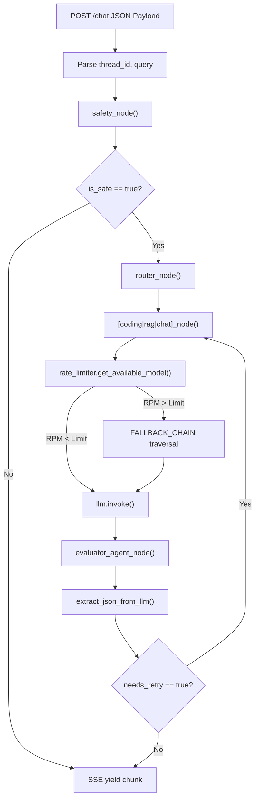

# Low Level Engineering Design (LLD)
### Cognibot Codebase Architecture & Execution Flow

---

### Section 1 — Codebase Architecture Map

```text
Cognibot/
├── backend/
│   └── main.py             → [Entry Point] → FastAPI endpoints, SSE streaming generator
├── core/
│   ├── graph.py            → [Orchestrator] → LangGraph edge definitions, node bindings
│   └── router.py           → [Routing logic] → Semantic routing, TASK_MODEL_MAP
├── agents/
│   ├── chat_agent.py       → [Node] → Generic conversational logic
│   ├── coding_agent.py     → [Node] → Qwen 2.5 Code generation + REPL tool integration
│   ├── evaluator_agent.py  → [Node] → LLM-as-a-judge, JSON validation, retry loops
│   ├── rag_agent.py        → [Node] → Document synthesis, prompt compliance
│   ├── research_agent.py   → [Node] → Tavily + ArXiv multi-hop tool routing
│   ├── safety_agent.py     → [Node] → Prompt injection interception
│   └── tools.py            → [Utilities] → Tool definitions (Search, REPL, Python)
├── rag/
│   ├── hybrid_retriever.py → [Pipeline] → BM25 + FAISS concurrent retrieval
│   ├── reranker.py         → [Pipeline] → Cross-encoder re-ranking top-k documents
│   └── ingest.py           → [Data Prep] → Semantic chunking, embedding generation
├── models/
│   ├── fallback.py         → [Wrapper] → Instantiation try/catch for resilience
│   └── nvidia.py           → [Wrapper] → LLM specific init, OpenRouter/Google branching
└── utils/
    └── rate_limiter.py     → [Infra] → Redis sliding-window algorithm, Fallback Chains
```

**Evaluation:**
- **Separation of Concerns:** High. State management (`core`), behavior (`agents`), and infrastructure (`utils`/`models`) are strictly isolated.
- **Testability:** Moderate. Testing LLM nodes requires mocking `ChatOpenAI`. 
- **Configurability:** High. Adding a new model is as simple as updating `TASK_MODEL_MAP` and `RATE_LIMITS`.

---

### Section 2 — Pipeline Flow (Code Level)



---

### Section 3 — Function-Level Breakdown (Critical Path)

```text
Function: get_available_model
File: utils/rate_limiter.py
Input: primary_model (str)
Output: actual_model (str)
What it does: Checks Redis if primary_model > 35 RPM. If yes, traverses FALLBACK_CHAIN until it finds an available model.
Hidden bugs: If ALL models in the chain are exhausted, it throws a KeyError.
How to improve: Add a hard-stop generic exception to return a polite "System overloaded" message to the UI.
```

```text
Function: evaluator_agent_node
File: agents/evaluator_agent.py
Input: state (AgentState)
Output: Updated AgentState (dict)
What it does: Injects Ground Truth context and generated answer into a strict JSON-demanding prompt to audit for hallucinations.
Hidden bugs: LLMs frequently wrap JSON in markdown (```json ... ```).
How to improve: Already mitigated via `re.search(r'\{.*\}', text)`. Could be improved using `PydanticOutputParser` and `with_structured_output`.
```

```text
Function: rag_agent_node
File: agents/rag_agent.py
Input: state (AgentState)
Output: Updated AgentState (dict)
What it does: Executes Hybrid Retrieval, Reranks, and injects context into a strictly factual system prompt.
Hidden bugs: Reasoning models (like Llama-3.3-Nemotron) occasionally return empty `content` strings while "thinking".
How to improve: Already mitigated via explicit `if not response.content.strip(): raise ValueError(...)`.
```

---

### Section 4 — API Layer Design

**Endpoint:** `POST /api/chat`
**Streaming:** Server-Sent Events (SSE) via `StreamingResponse`
**Request Schema:**
```json
{
  "message": "Write a python script to parse CSV.",
  "thread_id": "uuid-1234",
  "system_prompt": "Optional user override"
}
```
**Response Format (Yielded Chunks):**
```json
// Token Chunk
{"type": "token", "content": "import pandas as pd"}
// Status/Node Chunk
{"type": "status", "content": "Running Coding Agent..."}
// Error Chunk
{"type": "error", "content": "API Rate Limit Exhausted"}
```
**Missing in Production:** 
- JWT Authentication / API Key Bearer tokens.
- Request rate limiting at the API Gateway level (separate from LLM rate limiting).

---

### Section 5 — Edge Case Catalog

| Input Scenario | Current Behavior | Expected Behavior |
|---------------|-----------------|-------------------|
| **Primary LLM goes down (500 Error)** | `fallback_instantiation_failed` logged. | System cascades to the next fallback seamlessly. |
| **User asks speculative question in RAG** | Agent refuses to speculate based on strict prompt rules. | System enforces factual boundaries without hallucinating. |
| **Evaluator LLM outputs plain text instead of JSON** | Regex extractor fails, throws `JSONDecodeError`, defaults to `EvalResult(needs_retry=False)` to prevent infinite loop. | Bypasses audit to ensure user gets a response rather than a server crash. |
| **User uploads massive 10,000 page PDF** | Ingest route attempts to process immediately. | Should be offloaded to a background Celery/Redis Queue task. |

---

### Section 6 — Refactoring Blueprint

**Before (Brittle JSON Parsing in Evaluator):**
```python
raw_text = response.content
try:
    data = json.loads(raw_text)
except json.JSONDecodeError:
    # manual regex matching
    match = re.search(r'\{.*\}', raw_text, re.DOTALL)
    data = json.loads(match.group(0))
```

**After (Pydantic Structured Output):**
```python
from pydantic import BaseModel, Field

class EvalResult(BaseModel):
    needs_retry: bool = Field(description="True if hallucination or error detected")
    faithfulness: float = Field(description="Score between 0.0 and 1.0")

# LangChain automatically handles the JSON formatting, extraction, and retries natively
structured_llm = llm.with_structured_output(EvalResult)
result = structured_llm.invoke(messages)
```
**Why:** Hand-rolling regex for JSON extraction is fragile. `with_structured_output` leverages native OpenAI/NVIDIA tool-calling APIs to guarantee schema adherence.

---

### Section 7 — Production Upgrade Plan (30-Day)

**Week 1: Hardening the Frontend-Backend Contract**
- Implement Pydantic schema validation for all FastAPI incoming payloads.
- Migrate manual JSON parsing to `with_structured_output`.

**Week 2: Scaling Ingestion**
- Move `ingest.py` synchronous logic into a background `Celery` worker.
- Replace local `FAISS` with a distributed vector database like `Qdrant` or `Pinecone`.

**Week 3: Observability**
- Hook LangGraph traces directly into `LangSmith` or `Datadog` for visualizing token usage per node.
- Implement explicit billing tags per `thread_id`.

**Week 4: Security & Access Control**
- Implement OAuth2 JWT authentication on the `/api/chat` route.
- Add user-scoped routing to the Vector DB to ensure tenant isolation.
